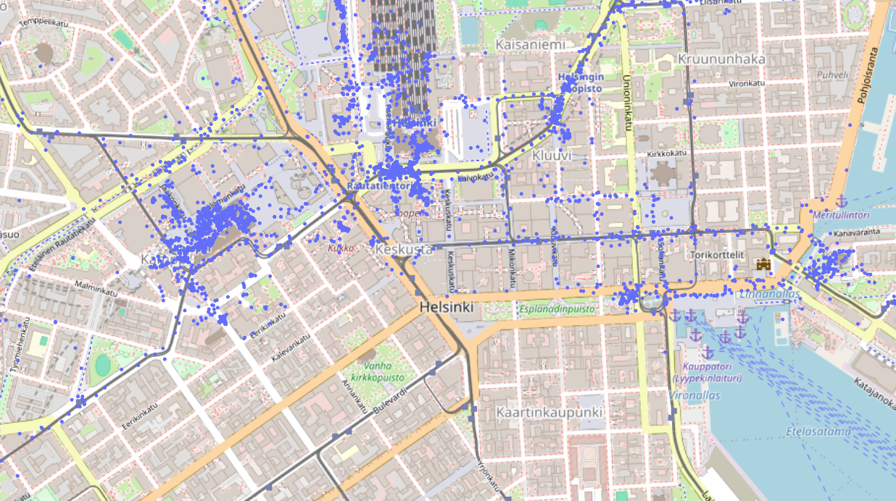

# Google Maps Location History Visualizer
A simple python script to parse your Google Maps Location History and show it on a map.

## Requirements
* Python 3.12.1 or later (Earlier versions might work too)
* Python packages in `requirements.txt`
* A good amount of Google Maps location history

## Usage
### Step 1. Obtain your Google Maps location history
Go to [the Google Maps data page](https://myaccount.google.com/yourdata/maps) and select "Download your Maps data". Be sure to select "Location History" at least. Make sure to request the data in json form.

After your data has finished processing (might take some time), you will recieve an email to download the data.

### Step 2. Install Python and necessary packages
Install [Python](https://www.python.org/) and the packages listed in `requirements.txt`.

### Step 3. Download the repository
Download or clone the repository. 

Move the `Records.json` file from your Google Maps data package inside the same folder as the `viz.py` script.

### Step 4. Run the script
If your record file is named something else as `Records.json`, configure it in the `config.yaml` file. If you want, you can set the `heatmap` option to `true` to view the data as a heatmap, but in my option it doesn't look as good.

Finally, run the `viz.py` script and watch how scarily accurate Google Maps location tracking can be.

## License
MIT